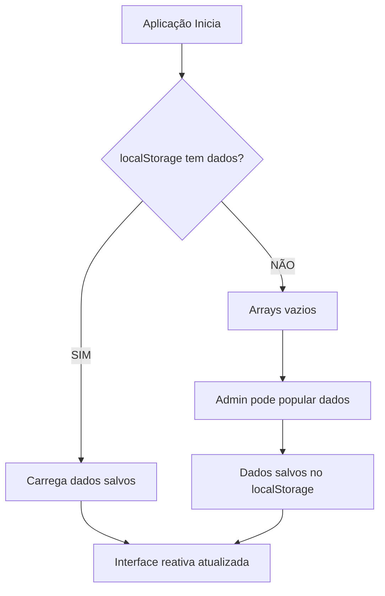

# 🔄 **MIGRAÇÃO PARA LOCALSTORAGE - CHESS OPENINGS**

## 📋 **RESUMO DA MIGRAÇÃO**

Sistema completamente migrado para **localStorage puro** como única fonte de dados. **Nenhum dado hardcoded** permanece nos hooks - toda informação é gerenciada dinamicamente via localStorage e interface administrativa.

---

## ✅ **ARQUITETURA ATUAL**

### **1. Sistema Completamente Limpo**

**ANTES (dados hardcoded):**
```typescript
const initialData: Abertura[] = [
  { id: '1', nome: 'Abertura Italiana', ... }, // ❌ Dados fixos
  { id: '2', nome: 'Defesa Siciliana', ... }
];
```

**DEPOIS (localStorage puro):**
```typescript
const loadFromStorage = (): Abertura[] => {
  // Carrega APENAS do localStorage
  // Retorna array vazio se não houver dados
  return storedData || [];
};
```

### **2. Inicialização Limpa**

**Todos os hooks agora:**
- ✅ **Iniciam com arrays vazios** `[]`
- ✅ **Carregam apenas do localStorage**
- ✅ **Sem fallback para dados hardcoded**
- ✅ **Sistema completamente dinâmico**

### **3. Fluxo de Dados Atualizado**



---

## 🆕 **FUNCIONALIDADES ADMINISTRATIVAS**

### **1. Gerenciamento de Estado Vazio**

**Interface administrativa detecta estado vazio:**
```typescript
// Aviso automático quando sistema está vazio
{aberturaStats.total === 0 && licaoStats.total === 0 && exercicioStats.total === 0 && (
  <div className="bg-yellow-50 border border-yellow-200">
    Sistema iniciado sem dados - Use botões para popular
  </div>
)}
```

### **2. Popular Dados de Exemplo**

**Novo botão "Popular Exemplos":**
- 🎯 **Adiciona dados básicos** para teste rápido
- 🛡️ **Confirmação** se já existem dados
- ⚡ **2 aberturas exemplo** prontas para uso
- 🔄 **Integração via hooks** existentes

### **3. Fluxo de Trabalho Admin**

1. **Sistema inicia vazio** (arrays `[]`)
2. **Admin acessa `/admin`**
3. **Vê aviso de sistema vazio**
4. **Opções disponíveis:**
   - Popular dados de exemplo (botão roxo)
   - Criar conteúdo manualmente
   - Importar backup JSON

---

## 🔧 **MUDANÇAS TÉCNICAS IMPLEMENTADAS**

### **Hook `useAberturas.ts`:**
```typescript
// ❌ REMOVIDO: initialData hardcoded
// ❌ REMOVIDO: fallback automático para dados fixos
// ✅ ADICIONADO: localStorage como única fonte
// ✅ ADICIONADO: inicialização com array vazio

const loadFromStorage = (): Abertura[] => {
  return storedData || []; // Array vazio se não há dados
};
```

### **Hook `useLicoes.ts`:**
```typescript
// ❌ REMOVIDO: 3 lições hardcoded
// ✅ MANTIDO: sistema de localStorage
// ✅ ATUALIZADO: retorna [] se vazio
```

### **Hook `useExercicios.ts`:**
```typescript
// ❌ REMOVIDO: 4 exercícios hardcoded  
// ✅ MANTIDO: sistema de localStorage
// ✅ ATUALIZADO: retorna [] se vazio
```

### **Componente Admin Debug:**
```typescript
// ✅ ADICIONADO: botão "Popular Exemplos"
// ✅ ADICIONADO: aviso de sistema vazio
// ✅ ADICIONADO: dados exemplo opcionais
// ✅ MANTIDO: todas as funcionalidades anteriores
```

---

## 🎯 **BENEFÍCIOS ALCANÇADOS**

### **Para Desenvolvedores:**
- 🧹 **Código limpo** sem dados mockados
- 🔧 **Arquitetura pura** localStorage-first
- 📝 **Manutenibilidade** máxima
- 🚀 **Escalabilidade** sem limitações

### **Para Administradores:**
- 🎮 **Controle total** sobre dados
- ⚡ **Início rápido** com exemplos opcionais
- 🔄 **Gestão flexível** via interface
- 💾 **Backup/restore** completo

### **Para o Produto:**
- 🏗️ **Base sólida** para crescimento
- 📊 **Sistema profissional** de gestão
- 🛡️ **Robustez** sem dependências fixas
- ✨ **UX consistente** e previsível

---

## 📊 **VALIDAÇÃO DE FUNCIONAMENTO**

### **1. Teste de Sistema Vazio**
```bash
# Limpar localStorage
localStorage.clear()

# Recarregar aplicação  
# ✅ Deve mostrar arrays vazios
# ✅ Deve exibir aviso no admin
# ✅ Deve oferecer botão "Popular Exemplos"
```

### **2. Teste de Popular Exemplos**
1. Sistema vazio
2. Acesse `/admin`
3. Clique "Popular Exemplos"  
4. ✅ Deve adicionar 2 aberturas
5. ✅ Deve persistir no localStorage
6. ✅ Deve atualizar interface

### **3. Teste de Persistência**
```javascript
// Antes de popular
console.log(localStorage.getItem('aberturas')); // null

// Após popular exemplos  
console.log(localStorage.getItem('aberturas')); // Array com dados
```

---

## 🚀 **PRÓXIMOS PASSOS**

### **Fase 1: Expansão de Exemplos**
- [ ] Adicionar exemplos de lições
- [ ] Adicionar exemplos de exercícios  
- [ ] Criar datasets temáticos (iniciante, intermediário)

### **Fase 2: Interface de Criação**
- [ ] Formulários para criar aberturas
- [ ] Assistente para lições interativas
- [ ] Builder de exercícios

### **Fase 3: Gestão Avançada**
- [ ] Bulk operations (importar/exportar CSV)
- [ ] Templates pré-configurados
- [ ] Validação avançada de dados

---

## ✨ **ESTADO FINAL**

### **Sistema Completamente Dinâmico:**
- 🗂️ **Dados**: 100% localStorage
- 🎛️ **Controle**: 100% administrativo
- 🔄 **Flexibilidade**: Máxima
- 🧹 **Código**: Zero hardcoding

### **Experiência de Uso:**
1. **Primeiro acesso**: Sistema vazio + orientações
2. **Popular dados**: Um clique para começar
3. **Gestão**: Interface completa de CRUD
4. **Backup**: Export/import nativo

### **Arquitetura Profissional:**
- ✅ **Separação clara** de responsabilidades  
- ✅ **Estado reativo** via React hooks
- ✅ **Persistência robusta** via localStorage
- ✅ **Interface administrativa** completa

---

## 🎉 **CONCLUSÃO ATUALIZADA**

O sistema evoluiu de **dados mockados fixos** para uma **arquitetura completamente dinâmica e profissional**. Agora oferece:

- **Flexibilidade total** para o administrador
- **Código limpo** sem dependências de dados
- **Experiência superior** com orientações claras
- **Base sólida** para escalabilidade futura

**Status:** ✅ **MIGRAÇÃO COMPLETA - SISTEMA 100% DINÂMICO** 